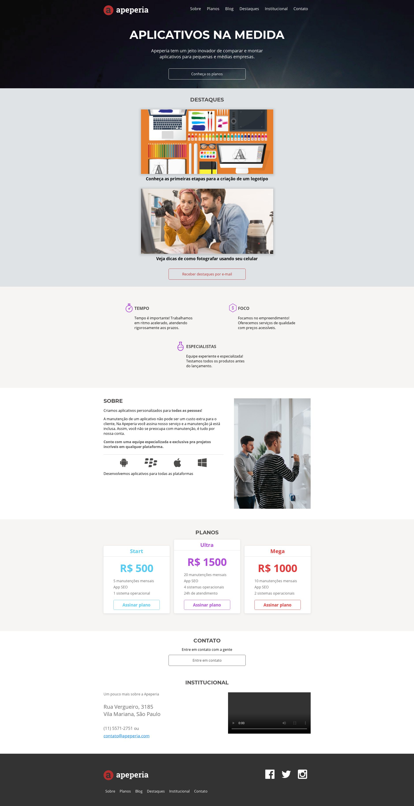

<h1 align="center">
    
</h1>

  :white_check_mark: <a href="https://andreadcsousa.github.io/alura_layout_responsivo/" target="_blank">Veja a página</a>&nbsp;&nbsp;&nbsp;|&nbsp;&nbsp;&nbsp;
  :white_check_mark: <a href="https://www.alura.com.br/formacao-acessibilidade-web" target="_blank">Conheça o curso</a>

# :computer: Projeto
 
- Idealizador: Alura
- Projeto: Formação Front-End
- Lado da força: Front-End
- Tipo: Acessibilidade Web
- Etapa: Criando sites para todo mundo

# :rocket: Tecnologias

Esse projeto foi desenvolvido com:

# :art: Layout

